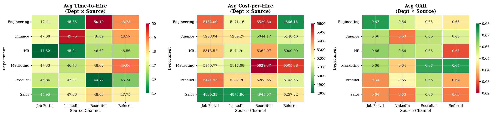
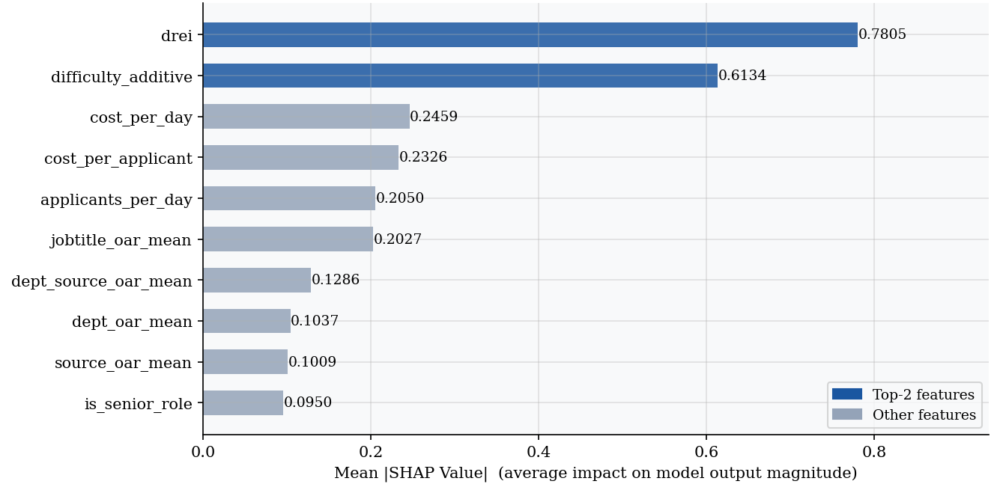
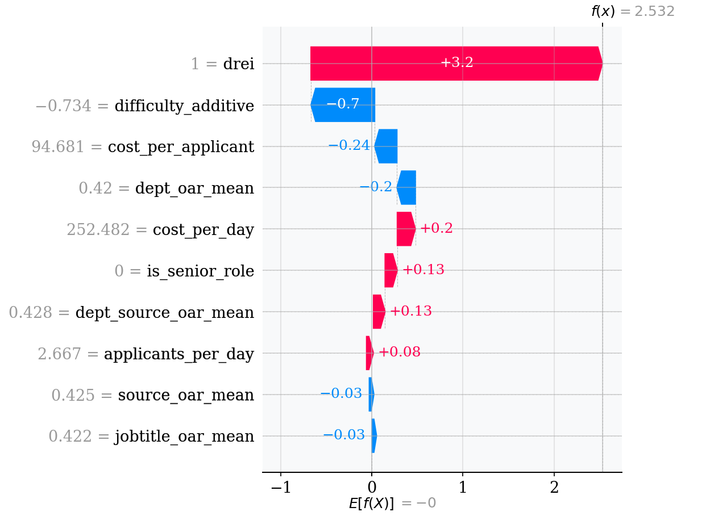
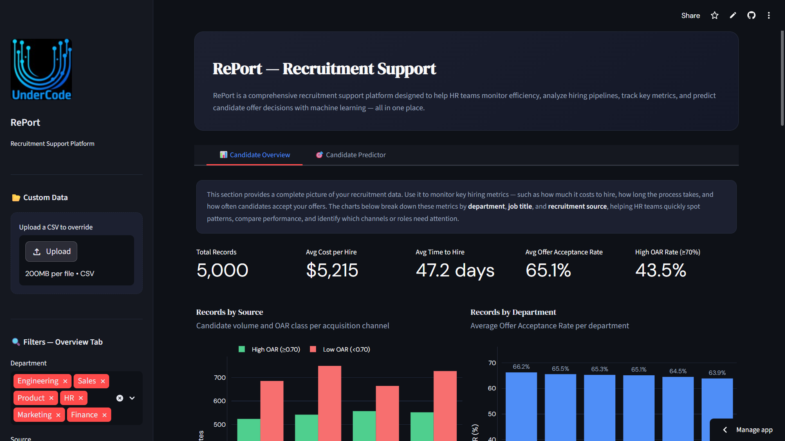
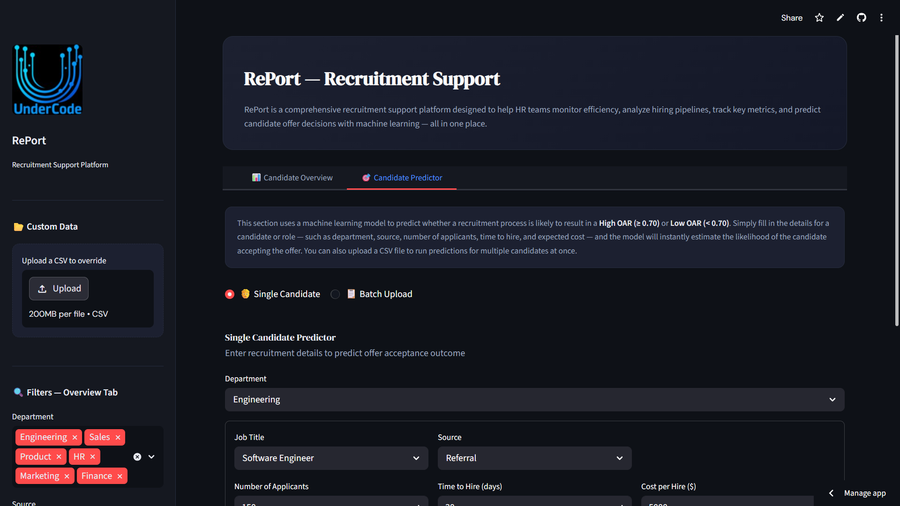

# 🎯 Recruitment Efficiency Prediction

<p align="left">
  
  
  
  
  
  
</p>

> **An end-to-end Data Science project to diagnose recruitment inefficiencies and predict Offer Acceptance Rate (OAR) using Machine Learning — deployed as an interactive HR dashboard.**

🌐 **Live Dashboard:** [https://undercode.streamlit.app/](https://undercode.streamlit.app/)

---

## 📌 Table of Contents

- [Project Overview](#-project-overview)
- [Business Problem](#-business-problem)
- [Objectives](#-objectives)
- [Dataset Description](#-dataset-description)
- [Tech Stack](#-tech-stack)
- [Project Structure](#-project-structure)
- [Workflow / Pipeline](#-workflow--pipeline)
- [Exploratory Data Analysis Highlights](#-exploratory-data-analysis-highlights)
- [Machine Learning Modeling](#-machine-learning-modeling)
- [Model Evaluation Results](#-model-evaluation-results)
- [Feature Importance & SHAP Explainability](#-feature-importance--shap-explainability)
- [Dashboard Features](#-dashboard-features)
- [App Preview](#-app-preview)
- [Installation Guide](#-installation-guide)
- [How to Run the Project](#-how-to-run-the-project)
- [Example Commands](#-example-commands)
- [Future Improvements](#-future-improvements)
- [Authors](#-authors)

---

## 📖 Project Overview

**Recruitment Efficiency Prediction** is a full-lifecycle Data Science project developed as part of the **Rakamin Data Science Career Bootcamp**. The project applies descriptive analytics, diagnostic analysis, and predictive machine learning to a dataset of **5,000 recruitment records** spanning six departments and four sourcing channels.

The core deliverable is **RePort** — a Streamlit-powered HR intelligence dashboard — that enables Talent Acquisition teams to monitor pipeline KPIs, benchmark against industry standards, and predict the likelihood of offer acceptance before extending an offer.

| Metric | Project Value | Industry Benchmark | Gap |
|---|---|---|---|
| Mean Time-to-Hire | 47.19 days | 36 days | +31% |
| Mean Cost-per-Hire | $5,214.83 | $4,683 | +11.3% |
| Offer Acceptance Rate | 65.08% | 80% | −14.92 pp |
| Model AUC-ROC (XGBoost) | 0.752 (CV) / 0.71 (test) | — | — |

---

## 💼 Business Problem

Modern recruitment functions face three compounding pressures: **longer hiring cycles**, **escalating costs**, and **declining offer acceptance rates**. Despite widespread adoption of Applicant Tracking Systems (ATS), the majority of hiring decisions are made without rigorous data-driven support.

Key pain points identified in this project:

- **33.2%** of requisitions exceed 60 days to fill — more than double the lean-pipeline benchmark.
- The organisation spends **$2.66M more per year** than the SHRM cost-per-hire benchmark (at 5,000 hires).
- **29% of candidates** fall in the sub-50% offer acceptance bracket, generating compounding re-engagement costs.
- No existing mechanism exists to **predict offer acceptance probability** before extending an offer.

---

## 🎯 Objectives

1. **Diagnose** current-state recruitment inefficiencies through descriptive and diagnostic analytics.
2. **Identify** the key drivers of offer acceptance and rejection via statistical testing and feature engineering.
3. **Predict** offer acceptance probability (OAR ≥ 70%) using a production-grade classification model.
4. **Deploy** a live, interactive HR dashboard enabling real-time scenario comparison and pre-offer prediction.

**SMART Goal:** Achieve ≥80% AUC-ROC in OAR prediction and improve Offer Acceptance Rate from 65.08% to 80% within a five-week deployment window.

---

## 📊 Dataset Description

The dataset contains **5,000 recruitment records** with no missing values, spanning 6 departments, 20 job titles, and 4 sourcing channels.

| Feature | Type | Values / Range | Description |
|---|---|---|---|
| `recruitment_id` | String (ID) | Unique | Record identifier |
| `department` | Categorical | Engineering, Finance, HR, Marketing, Product, Sales | Organisational unit |
| `job_title` | Categorical | 24 distinct roles | Role being recruited |
| `source` | Categorical | LinkedIn, Referral, Recruiter, Job Portal | Primary sourcing channel |
| `num_applicants` | Integer | 10 – 299 | Candidates entering the pipeline |
| `time_to_hire_days` | Integer | 7 – 89 | Calendar days from opening to accepted offer |
| `cost_per_hire` | Float | $507 – $9,999 | Total direct recruitment cost (USD) |
| `offer_acceptance_rate` | Float (Target) | 0.30 – 1.00 | Proportion of offers accepted (**target variable**) |

**Target Engineering:** Due to the uniform distribution of `offer_acceptance_rate`, the target was binarised at the **0.70 threshold** (OAR ≥ 0.70 → Class 1: High Acceptance; OAR < 0.70 → Class 0: Low Acceptance), yielding an approximately balanced class split (~50/50).

---

## 🛠️ Tech Stack

| Category | Tools |
|---|---|
| **Language** | Python 3.10+ |
| **Data Manipulation** | Pandas, NumPy |
| **Machine Learning** | Scikit-learn, XGBoost |
| **Imbalance Handling** | imbalanced-learn (SMOTE) |
| **Hyperparameter Tuning** | Random Search |
| **Model Explainability** | SHAP |
| **Visualisation** | Matplotlib, Seaborn |
| **Dashboard** | Streamlit |
| **Model Serialisation** | Joblib |
| **Version Control** | Git, GitHub |
| **Deployment** | Streamlit Community Cloud |

---

## 📁 Project Structure

```
recruitment-efficiency-prediction/
│
├── data/
│   └── raw/
│       └── recruitment_efficiency_improved.csv   # Source dataset (5,000 records)
│
├── models/
│   └── recruitment_model.joblib                  # Trained XGBoost model + full pipeline artefacts
│
├── notebooks/
│   ├── Stage 0  Project Initiation & Problem Framing.ipynb
│   ├── Stage 1 Data Acquisition & Preparation.ipynb
│   ├── Stage 2 Model Development & Experimentation.ipynb
│   ├── Stage 3 Model Evaluation & Interpretability.ipynb
│   └── Stage 4 Deployment & Business Integration.ipynb
│
├── src/
│   └── UnderCode.png                             # Team logo / dashboard icon
│
├── app.py                                        # Main Streamlit dashboard application
├── requirements.txt                              # Python dependencies
├── .gitignore
└── README.md
```

---

## 🔄 Workflow / Pipeline

```
┌────────────────────────────────────────────────────────────────────────────┐
│                       END-TO-END PROJECT PIPELINE                          │
├────────────────────────────────────────────────────────────────────────────┤
│  Stage 0     │  Problem Framing · Stakeholder Matrix · SMART Goals         │
│  Stage 1     │  Data Acquisition · Wrangling · Quality Audit · EDA         │
│  Stage 2     │  Feature Engineering · Baseline Models · Optuna Tuning      │
│  Stage 3     │  Evaluation · SHAP Interpretability · Bias & Fairness       │
│  Stage 4     │  Streamlit Dashboard · GitHub · Streamlit Cloud Deploy      │
└──────────────┴─────────────────────────────────────────────────────────────┘
```

### Stage 0 — Project Initiation & Problem Framing
- Defined stakeholder matrix (CHRO, TA Director, Finance, Hiring Managers, Data Team)
- Established SMART goals, KPI definitions, and project scope
- Documented risk register and assumption log

### Stage 1 — Data Acquisition & Preparation
- Ingested 5,000 recruitment records; confirmed zero missing values
- Applied dtype optimisation (categorical casting, ID string conversion)
- Conducted distributional audits: Kolmogorov-Smirnov uniformity tests, Pearson correlation matrix, ANOVA across all categorical features
- Identified data generation anomalies (uniform distributions, 0.01 OAR spacing) and documented modelling implications

### Stage 2 — Model Development & Experimentation
- Engineered 9 domain-informed features across pre-split and post-split phases (see [Feature Engineering](#-feature-importance--shap-explainability))
- Produced scaled and raw feature matrices for linear and tree-based model families respectively
- Trained 7 baseline models; tuned all with Optuna Bayesian search (100 trials per model)
- Selected **XGBoost** as the final model (best CV AUC-ROC: 0.752)

### Stage 3 — Model Evaluation & Interpretability
- Full test-set evaluation (20% holdout): AUC-ROC, F1, Precision, Recall, Confusion Matrix
- SHAP analysis: global summary, dependence plots, waterfall charts for individual predictions
- Subgroup fairness analysis across department, sourcing channel, and job title
- Documented bias risks with severity ratings and mitigation recommendations

### Stage 4 — Deployment & Business Integration
- Built RePort dashboard (`app.py`) with two tabs: Candidate Overview and Candidate Predictor
- Serialised complete feature engineering pipeline into `recruitment_model.joblib`
- Deployed to Streamlit Community Cloud with auto-redeploy on every push to `main`

---

## 🔍 Exploratory Data Analysis Highlights

### KPI Benchmarking

All three headline KPIs fall materially below industry standards:

```
Time-to-Hire:          47.19 days  │████████████████████░░░░░░│  Benchmark: 36 days
Cost-per-Hire:         $5,214.83   │██████████████████████░░░░│  Benchmark: $4,683
Offer Acceptance Rate: 65.08%      │████████████████░░░░░░░░░░│  Benchmark: 80%
```

### Distributional Findings

- All four numeric features follow **near-uniform distributions** (confirmed via KS test, p >> 0.05)
- Maximum Pearson correlation across any feature pair: **r < 0.02** — confirming statistical independence of raw features
- OAR breakdown: 29.0% Low (<50%) · 29.1% Medium (50–70%) · 27.6% High (70–90%) · 14.3% Very High (>90%)

### Statistical Testing

| Test | Feature | Result |
|---|---|---|
| One-way ANOVA | Department vs OAR | F ≈ 1.37, p = 0.23 — Not significant |
| One-way ANOVA | Source vs OAR | F ≈ 1.11, p = 0.34 — Not significant |
| One-way ANOVA | Job Title vs OAR | F ≈ 1.33, p = 0.13 — Not significant |
| KS Test | All numeric features vs Uniform | All p >> 0.05 — Uniform confirmed |

**Key insight:** No raw categorical feature achieves statistical significance against OAR, pointing to the necessity of **domain-informed feature engineering** before modelling.

### Department & Source Heatmaps

Cross-tabulated heatmaps of KPIs at the department × source intersection reveal **no dominant outlier combinations** — the performance deficit is structural at the organisational level, not attributable to isolated department-channel pairs.



---

## 🤖 Machine Learning Modeling

### Target Definition

Binary classification target at the **OAR = 0.70 threshold**:

```python
df['target_high_oar'] = (df['offer_acceptance_rate'] >= 0.70).astype(int)
# Class 0: Low OAR  (~50%)
# Class 1: High OAR (~50%)
```

### Feature Engineering

Ten domain-informed features were constructed to compensate for the near-zero raw feature correlations:

| Feature | Formula / Method | Business Interpretation |
|---|---|---|
| `cost_per_applicant` | `cost_per_hire ÷ num_applicants` | Spend efficiency per candidate screened |
| `cost_per_day` | `cost_per_hire ÷ time_to_hire_days` | Daily resource burn rate |
| `applicants_per_day` | `num_applicants ÷ time_to_hire_days` | Pipeline velocity signal |
| `difficulty_additive` | `(z_time + z_cost) / 2` | Composite friction score (training stats only) |
| `DREI` | Binary flag vs dept. median | Department Recruitment Efficiency Index |
| `dept_oar_mean` | Smoothed target encoding (dept) | Historical dept-level acceptance baseline |
| `jobtitle_oar_mean` | Smoothed target encoding (job title) | Historical role-level acceptance signal |
| `source_oar_mean` | Smoothed target encoding (source) | Historical channel-level acceptance signal |
| `dept_source_oar_mean` | Smoothed target encoding (dept × source) | Interaction: dept + channel efficiency |
| `DREI` | `1` if `cost_per_hire` < dept median **and** `time_to_hire` < dept median **and** `OAR` > global median, else `0` | Department-Relative Efficiency Indicator — flags roles where cost, speed, and acceptance all outperform their departmental baseline simultaneously |

> ⚠️ Target encoding mappings were fitted **exclusively on the training set** to prevent data leakage. Anti-leakage validation confirmed test-set correlation with training labels was well below 0.90.

### Model Selection

Seven algorithms were evaluated — all with default baselines followed by Optuna Bayesian hyperparameter tuning (100 trials per model):

| Model | Baseline AUC-ROC | Tuned CV AUC-ROC | Tuned Test F1 |
|---|---|---|---|
| **XGBoost** ⭐ | **0.706** | **0.752** | **0.563** |
| Gradient Boosting | 0.719 | 0.748 | 0.476 |
| Random Forest | 0.701 | 0.748 | 0.532 |
| Logistic Regression | 0.713 | 0.696 | 0.575 |
| Support Vector Machine | 0.681 | 0.696 | 0.435 |
| K-Nearest Neighbors | 0.631 | 0.717 | 0.553 |
| Decision Tree | 0.570 | 0.691 | 0.524 |

**XGBoost** was selected as the final model based on its highest CV AUC-ROC (0.752) and strong generalisation to the held-out test set.

**Final XGBoost Configuration:**

```python
XGBClassifier(
    n_estimators      = 317,
    max_depth         = 8,
    learning_rate     = 0.06420330336297862,
    subsample         = 0.9706635463175177,
    colsample_bytree  = 0.7246844304357644,
    min_child_weight  = 2,
    gamma             = 0.2600340105889054,
    reg_alpha         = 0.006295301484516136,
    reg_lambda        = 0.009456951897345888,
    eval_metric       = 'logloss',
    random_state      = 42,
    use_label_encoder = False
)
```

---

## 📈 Model Evaluation Results

### Overall Test-Set Performance

| Metric | Score |
|---|---|
| **AUC-ROC** | **0.71** |
| **F1-Score** | **0.563** |
| Accuracy | 62.3% |
| Precision (Class 1) | ~0.636 |
| Recall (Class 1) | ~0.562 |

### Subgroup Performance — Sourcing Channel

| Source | F1 | AUC-ROC | FP Rate | FN Rate | Status |
|---|---|---|---|---|---|
| Recruiter | 0.60 | 0.74 | 0.148 | 0.202 | ✅ Best |
| Job Portal | 0.59 | 0.71 | 0.211 | 0.147 | ✅ Second |
| LinkedIn | 0.53 | 0.70 | 0.143 | 0.211 | ⚠️ Below mean |
| Referral | 0.52 | 0.67 | 0.137 | 0.249 | ❌ Worst |

### Subgroup Performance — Department

| Department | F1 | AUC-ROC | FP Rate | FN Rate | Status |
|---|---|---|---|---|---|
| Finance | 0.69 | 0.802 | 0.097 | 0.181 | ✅ Best |
| Engineering | 0.60 | 0.692 | 0.200 | 0.181 | ✅ Above mean |
| Sales | 0.55 | 0.719 | 0.197 | 0.158 | ⚠️ Mixed |
| HR | 0.52 | 0.694 | 0.102 | 0.277 | ❌ High FN risk |
| Marketing | 0.51 | 0.629 | 0.193 | 0.211 | ❌ Lowest AUC |
| Product | 0.50 | 0.710 | 0.172 | 0.201 | ⚠️ Threshold issue |

---

## 🔬 Feature Importance & SHAP Explainability

SHAP (SHapley Additive exPlanations) values were used to interpret individual predictions and aggregate global feature importance across the test set.

### Global Feature Importance (Mean |SHAP|)

| Rank | Feature | Mean SHAP | Interpretation |
|---|---|---|---|
| 1 | `drei` | 0.7805 | Department Recruitment Efficiency Index — dominant binary driver of predicted acceptance |
| 2 | `difficulty_additive` | 0.6134 | Combined time + cost friction score — high values strongly reduce predicted acceptance |
| 3 | `cost_per_day` | 0.2459 | Daily resource burn rate — captures hidden inefficiency in prolonged searches |
| 4 | `cost_per_applicant` | 0.2326 | Spend efficiency per screened candidate |
| 5 | `applicants_per_day` | 0.2050 | Pipeline velocity — reflects role attractiveness and sourcing quality |
| 6 | `jobtitle_oar_mean` | 0.2027 | Historical role-level acceptance baseline |
| 7 | `dept_source_oar_mean` | 0.1286 | Interaction signal: dept x channel historical efficiency |
| 8 | `dept_oar_mean` | 0.1037 | Department-level historical OAR provides contextual baseline |
| 9 | `source_oar_mean` | 0.1009 | Channel-level historical performance adjusts predictions |
| 10 | `is_senior_role` | 0.0950 | Senior roles exhibit structurally different acceptance dynamics |



### SHAP Waterfall — Individual Prediction

Each prediction in the dashboard is accompanied by a SHAP waterfall chart showing which features pushed the prediction toward High OAR (positive SHAP) or Low OAR (negative SHAP), enabling HR teams to understand and act on individual scoring outcomes.



### ⚠️ Identified Bias Risks

| Risk | Severity | Affected Group | Issue |
|---|---|---|---|
| Marketing Specialist score inversion | **Critical** | Job title | AUC-ROC = 0.485 (below random chance) |
| Product Manager near-failure | **Critical** | Job title | F1 = 0.296, AUC = 0.570 |
| HR dept. under-estimation | **High** | Department | FN Rate = 27.7% — high-efficiency HR roles missed |
| Referral channel bias | **High** | Source | FN Rate = 24.9% — informal channels systematically underpredicted |
| `jobtitle_oar_mean` feedback loop | **High** | Model architecture | Worst-performing titles decay further across retraining cycles |

---

## 🖥️ Dashboard Features

**RePort** is a two-tab Streamlit dashboard deployed on Streamlit Community Cloud.

### Tab 1 — Candidate Overview

Real-time KPI monitoring and recruitment pipeline analytics for HR managers and TA leadership.

| Feature | Description |
|---|---|
| KPI Cards | Total Records · Avg. Cost per Hire · Avg. Time to Hire · Avg. OAR · High OAR Rate (≥70%) |
| Records by Source | Grouped bar: candidate volume split by High/Low OAR per acquisition channel |
| Records by Department | Bar chart: average OAR per department, sorted by performance |
| Records by Job Title | Horizontal bar: top 15 roles by candidate volume |
| OAR Distribution | Stacked histogram with 0.70 classification threshold marker |
| Cost & Time to Hire | Side-by-side box plots: High vs. Low OAR class comparison |
| Feature Importances | XGBoost feature importance horizontal bar chart |
| KPI Summary by Source | Three-panel: average cost, time, and OAR per sourcing channel |
| Candidate Records Table | Paginated table with sidebar filters (dept/source) and CSV export |

### Tab 2 — Candidate Predictor

Pre-offer decision support tool enabling HR to assess acceptance likelihood before extending an offer.

| Feature | Description |
|---|---|
| Single Candidate Predictor | Input form: department, job title (dept-linked), source, applicants, TTH, CPH, expected OAR → returns prediction label, probability score, and gauge chart |
| Insight Cards | 5 cards: Cost Efficiency · Time to Hire · Source Quality · Pipeline Volume · Overall Difficulty — each with status tags (On Track / Needs Attention / Action Required) |
| What-If Scenario Comparison | Side-by-side two-scenario comparison — adjustable source, applicants, TTH, CPH, and OAR — to identify the higher-efficiency approach before committing |
| Batch Upload Predictor | CSV upload for bulk candidate scoring; returns downloadable results with High/Low OAR labels and probability scores |

---

## 📸 App Preview





---

## ⚙️ Installation Guide

### Prerequisites

- Python 3.10 or higher
- pip or conda package manager
- Git

### 1. Clone the Repository

```bash
git clone https://github.com/faisal-khoirudin/rakamin-final-project-recruitment-efficiency.git
cd rakamin-final-project-recruitment-efficiency
```

### 2. Create a Virtual Environment

```bash
# Using venv
python -m venv venv
source venv/bin/activate          # macOS / Linux
venv\Scripts\activate             # Windows

# Or using conda
conda create -n recruitment-env python=3.10
conda activate recruitment-env
```

### 3. Install Dependencies

```bash
pip install -r requirements.txt
```

`requirements.txt` includes:

```txt
streamlit
pandas
numpy
joblib
plotly
xgboost
scikit-learn
imbalanced-learn
```

---

## ▶️ How to Run the Project

### Run the Streamlit Dashboard (Recommended)

```bash
streamlit run app.py
```

The app will open automatically at `http://localhost:8501`.

### Run Notebooks in Order

```bash
notebooks/Stage 0 Project Initiation & Problem Framing.ipynb
notebooks/Stage 1 Data Acquisition & Preparation.ipynb
notebooks/Stage 2 Model Development & Experimentation.ipynb
notebooks/Stage 3 Model Evaluation & Interpretability.ipynb
notebooks/Stage 4 Deployment & Business Integration.ipynb
```

### Load the Trained Model Programmatically

```python
import joblib
import pandas as pd

# Load model bundle
bundle           = joblib.load("models/recruitment_model.joblib")
model            = bundle["model"]
final_features   = bundle["final_features"]
dept_map         = bundle["dept_map"]
jobtitle_map     = bundle["jobtitle_map"]
source_map       = bundle["source_map"]
deptsrc_map      = bundle["deptsrc_map"]
global_mean      = bundle["global_mean"]
smooth_k         = bundle["smooth_k"]
time_mean_train  = bundle["time_mean_train"]
time_std_train   = bundle["time_std_train"]
cost_mean_train  = bundle["cost_mean_train"]
cost_std_train   = bundle["cost_std_train"]
dept_medians     = bundle["dept_medians"]  # columns: dept_median_cph, dept_median_tth, dept_median_oar

# Apply feature engineering + predict
# (see app.py for the full pipeline implementation)
```

---

## 💻 Example Commands

```bash
# Run dashboard locally
streamlit run app.py

# Run a specific notebook
jupyter nbconvert --to notebook --execute notebooks/Stage 2 Model Development & Experimentation.ipynb

# Retrain the model (from Stage 2 notebook output)
python -c "import joblib; bundle = joblib.load('models/recruitment_model.joblib'); print(bundle['model'])"

# Check model artefacts
python -c "
import joblib
b = joblib.load('models/recruitment_model.joblib')
print('Features:', b['final_features'])
print('Model:', b['model'])
"

# Run batch prediction via CLI
python -c "
import joblib, pandas as pd
bundle = joblib.load('models/recruitment_model.joblib')
# Load your CSV and apply the pipeline from app.py
"
```

---

## 🚀 Future Improvements

| Priority | Improvement | Rationale |
|---|---|---|
| 🔴 Critical | Exclude Marketing Specialist & Product Manager from automated scoring | AUC-ROC below random chance (0.485) — active harm risk |
| 🔴 High | Apply dept-specific decision thresholds | HR (high FN) and Product (high AUC / low F1) require recalibration |
| 🟠 High | Integrate live ATS data feed | Eliminate manual CSV uploads; enable real-time predictions |
| 🟠 High | Break `jobtitle_oar_mean` feedback loop | Floor the feature at global mean to prevent progressive decay |
| 🟡 Medium | Enrich training data with interview scores and assessment results | Current model uses only process metrics — candidate quality signals needed |
| 🟡 Medium | Expand training data beyond 5,000 records | More data → better generalisation; target ≥15,000 records for retraining |
| 🟡 Medium | Build active learning feedback loop | HR marks predictions as correct/incorrect to enable quarterly retraining |
| 🟢 Low | Add user authentication to the dashboard | Currently public URL — candidate data should be access-controlled |
| 🟢 Low | Develop department-specific model variants | F1 range of 0.478 across job titles warrants targeted submodels |

---

## 👥 Authors

This project was developed by the **UnderCode Team** as a final project for the **Rakamin Data Science Career Bootcamp**.

| Name | Role |
|---|---|
| **Faisal Khoirudin** | Project Manager |
| **Irsan Maulana Yusuf** | Data Analyst |
| **Achmad Kamil** | Data Scientist |
| **Taufiq Jonel Tandra** | Data Engineer |

---

<p align="center">
  <sub>Built with ❤️ by the UnderCode Team · Rakamin Data Science Career Bootcamp · 2026</sub>
</p>
